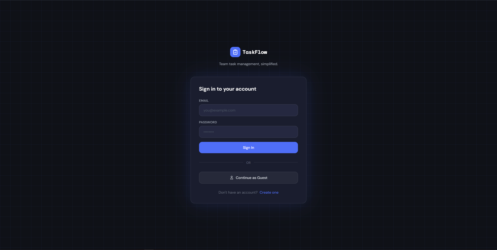
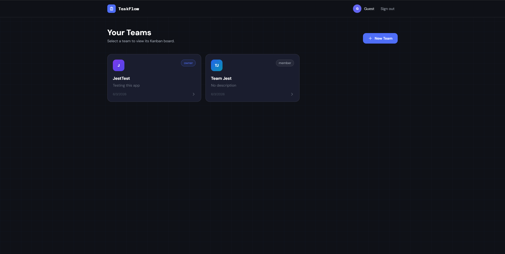
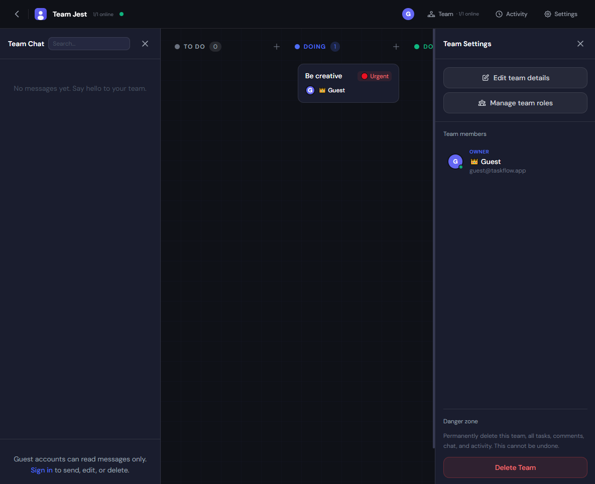

# TaskFlow — Real-Time Team Task Manager Web App

A real-time team task manager with Kanban boards, built with Node.js, Express, Supabase, and Tailwind CSS.

https://taskflow-byjest.onrender.com

## Screenshots

**Sign in** — register, sign in, or continue as guest.



**Dashboard** — create teams and open a Kanban board.



**Kanban board** — columns, tasks, team invites, and activity.



---

## Features
- User registration & login (email/password, Google, GitHub via Supabase Auth, plus guest account)
- Create teams and invite members by email
- Kanban board (To Do / Doing / Done) with drag-and-drop
- Real-time task updates via polling (5s interval)
- Task comments
- Team chat (read-only for guests; send, edit, and delete for signed-in users)
- Due dates, priorities, and assignees
- Activity history per team
- Responsive design

---

## Project Structure

```
taskflow/
├── server.js              # Express app entry point
├── package.json
├── schema.sql             # Run this in Supabase SQL Editor
├── lib/
│   └── supabase.js        # Supabase client setup
├── middleware/
│   └── auth.js            # Session auth middleware
├── routes/
│   ├── auth.js            # Login, register, logout
│   ├── teams.js           # Team CRUD + invite
│   └── tasks.js           # Tasks, comments, activity
└── public/
    ├── login.html
    ├── register.html
    ├── dashboard.html     # Team list
    └── board.html         # Kanban board
```

---

## Usage

1. **Register** or use the guest account
2. From the **Dashboard**, click **New Team** to create a team
3. Click on a team card to open its **Kanban Board**
4. Use **+ buttons** on each column to add tasks
5. **Drag & drop** tasks between columns
6. **Click a task** to open its detail panel (edit priority, due date, assignee, add comments)
7. Click **Team** in the navbar to invite members by email
8. Click **Activity** to see recent team activity
9. Use the **chat button** (bottom-left) for team-wide messages

---

## Tech Stack

| Layer      | Tech                            |
|------------|---------------------------------|
| Backend    | Node.js, Express                |
| Database   | Supabase (PostgreSQL)           |
| Auth       | Supabase Auth + express-session |
| Frontend   | HTML, Tailwind CSS (CDN)        |
| Real-time  | 5-second polling                |
| Deployment | Render                          |
