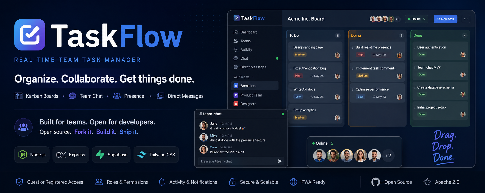

# TaskFlow — Real-Time Team Task Manager

A real-time team task manager with Kanban boards, team chat, direct messages, and presence indicators. Built with Node.js, Express, Supabase, and Tailwind CSS.

**Live demo:** [taskflow-byjest.onrender.com](https://taskflow-byjest.onrender.com)



---

## Features

High-level overview:

- Guest or registered sign-in (email/password, Google, GitHub)
- Teams with owner and member roles; custom display roles
- Kanban board (To Do / Doing / Done) with drag-and-drop and 5s polling sync
- Tasks with priority, due dates, assignees, comments, reactions, and @mentions
- Team chat (read-only for guests) and direct messages (registered users)
- Team invites by email, activity log, and online presence on boards
- PWA install support and responsive UI
- In-app feedback with optional admin inbox

**Full feature matrix (guest vs registered, owner vs member):** see **[FEATURES.md](FEATURES.md)**.

You can also fetch the same document at runtime: `GET /features.md` (served from `FEATURES.md` for the guest registration notice in the app).

---

## Welcome, developers

TaskFlow is open source and built for collaboration. Whether you want to contribute to this repo, run your own instance, or **fork and ship a product you own**, you are welcome here.

| Goal | Where to start |
|------|----------------|
| **Contribute** | See [CONTRIBUTING.md](CONTRIBUTING.md). Feature details: [FEATURES.md](FEATURES.md). Planned work: [docs/FEATURE_CHECKLIST.md](docs/FEATURE_CHECKLIST.md). |
| **Self-host** | Follow [Getting started](#getting-started) below and configure your own Supabase project. |
| **Build & sell your own product** | Fork the project, rebrand, deploy, and monetize your deployment. The [Apache License 2.0](LICENSE) allows commercial use. You may add subscriptions, paid tiers, or proprietary plugins on **your** deployment. |
| **Use the official hosted app** | The public demo may add **in-app subscriptions or paid features** later that are exclusive to that service and not guaranteed to exist in this repository. |

Please keep the license file with any distribution and document your own changes. The **TaskFlow** name on the official demo is not a requirement for your fork unless you want to align branding.

---

## Getting started

### Prerequisites

- Node.js 18+
- A [Supabase](https://supabase.com) project (PostgreSQL, Auth, Storage)

### 1. Clone and install

```bash
git clone <your-repo-url>
cd taskflow
npm install
```

### 2. Environment variables

Copy the example file and fill in your values:

```bash
cp .env.example .env
```

| Variable | Required | Description |
|----------|----------|-------------|
| `SUPABASE_URL` | Yes | Supabase project URL |
| `SUPABASE_ANON_KEY` | Yes | Public anon key (OAuth in browser) |
| `SUPABASE_SERVICE_ROLE_KEY` | Yes | Service role key (server only; never expose to clients) |
| `SESSION_SECRET` | Yes | Long random string for `express-session` |
| `PORT` | No | Default `3000` |
| `TURNSTILE_SITE_KEY` | No | Cloudflare Turnstile site key (guest feedback captcha) |
| `TURNSTILE_SECRET_KEY` | No | Turnstile secret key |
| `FEEDBACK_ADMIN_EMAIL` | No | Registered user email that can view the feedback inbox (hidden when unset) |

### 3. Supabase setup

1. Open **SQL Editor** in your Supabase project and run **[schema.sql](schema.sql)** (creates all tables, enables RLS, and seeds the guest user).
2. In **Storage**, create a public bucket named **`avatars`** and other buckets listed in **[CONTRIBUTING.md](CONTRIBUTING.md)** and **[schema.sql](schema.sql)**.
3. In **Authentication**, enable Email and any OAuth providers you want (Google, GitHub).

See [CONTRIBUTING.md](CONTRIBUTING.md) for more setup detail.

### 4. Run locally

```bash
npm run dev
```

Open [http://localhost:3000](http://localhost:3000).

### 5. PWA icons (optional)

```bash
npm run icons:pwa
```

---

## Project structure

```
taskflow/
├── server.js                 # Express entry (API + static files + sessions)
├── package.json
├── FEATURES.md               # In-depth feature list (also served at /features.md)
├── CONTRIBUTING.md           # Contributor guide
├── schema.sql                # Supabase / PostgreSQL schema
├── LICENSE                   # Apache License 2.0
├── .env.example
├── lib/                      # Supabase, auth helpers, presence, guards, reactions
├── middleware/
│   └── auth.js               # Session auth middleware
├── routes/
│   ├── auth.js               # Login, register, guest, OAuth, logout
│   ├── teams.js              # Teams, invites, avatars, roles, presence
│   ├── tasks.js              # Tasks, comments, activity
│   ├── profile.js            # Profile and user avatar
│   ├── chat.js               # Team chat
│   ├── dm-chat.js            # Direct messages
│   ├── dm-settings.js        # DM blocks and ignores
│   ├── reactions.js          # Emoji reactions
│   └── feedback.js           # User feedback
├── public/                   # Frontend (HTML, JS, PWA assets) — required
│   ├── login.html
│   ├── register.html
│   ├── dashboard.html
│   ├── board.html
│   ├── api.js                # Shared client utilities
│   └── avatars/              # Preset SVG avatars
├── docs/images/              # README screenshots
└── scripts/
    └── generate-pwa-icons.mjs
```

The **`public/`** folder is the web client. Express serves it as static files and also serves `dashboard.html` and `board.html` behind authentication for specific routes.

---

## Usage (quick tour)

1. **Register** or use **Continue as guest** on the login page.
2. From the **Dashboard**, create a **New Team** and open its board.
3. Add tasks with **New task** button; **drag and drop** between columns.
4. **Click a task** to edit details and add comments (registered users get full edit/delete).
5. Open **Team** on the board to invite members (registered owner; not for guest-owned teams).
6. Use **Activity** for the team feed and the **chat** button for team-wide messages.
7. Registered users: **Direct messages** from the dashboard FAB and **profile** from the header.

---

## Tech stack

| Layer      | Technology                          |
|------------|-------------------------------------|
| Backend    | Node.js, Express                    |
| Database   | Supabase (PostgreSQL)               |
| Auth       | Supabase Auth + express-session     |
| Storage    | Supabase Storage                    |
| Frontend   | HTML, Tailwind CSS (CDN), vanilla JS|
| Real-time  | 5-second polling                    |
| Deployment | Render                              |

---

## License

This project is licensed under the **[Apache License 2.0](LICENSE)**.

You may use, modify, distribute, and sell your own deployments based on this code. There is **no** requirement to open-source paid features you add on top. The official hosted TaskFlow service may later offer **subscription-only capabilities** on that environment; those are separate from what this repository provides.

For questions about licensing your fork or commercial use, refer to the LICENSE file and consider documenting your own terms of service for end users.
